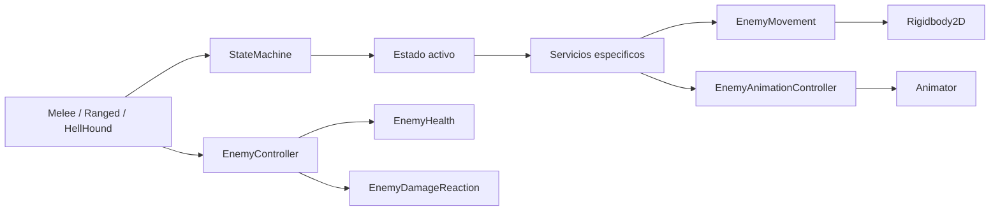
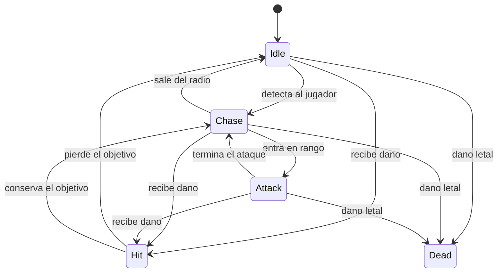
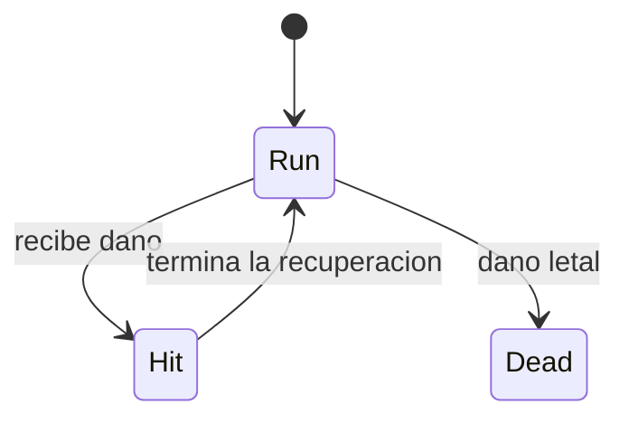
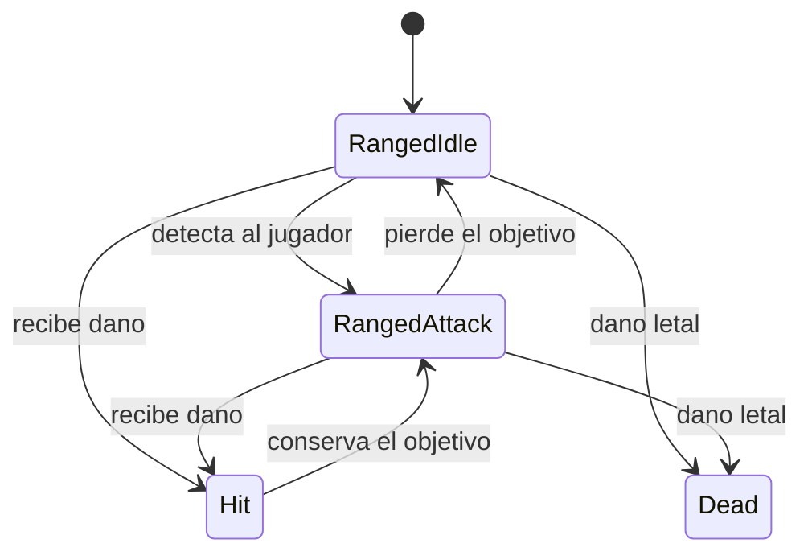

# Sistema de enemigos

Esta carpeta contiene el comportamiento, combate, vida, movimiento, audio y estados
de los enemigos. El sistema comparte el ciclo de vida de un enemigo, pero cada tipo
construye sus propios estados y servicios de gameplay.

## Flujo general



`EnemyController.Awake()` crea vida, movimiento, animacion, reaccion al dano y los
estados comunes `Hit` y `Dead`. Luego llama a `CreateInitialState()`, donde cada
enemigo concreto construye su Composition Root especifico.

## Responsabilidades

| Script | Responsabilidad |
| --- | --- |
| `EnemyController` | Integra Unity y comparte vida, hit, muerte, registro y limpieza. |
| `MeleeEnemy` | Construye deteccion, persecucion, ataque con hitbox y drops. |
| `RangedEnemy` | Construye deteccion y disparo sin desplazamiento. |
| `HellHoundEnemy` | Construye una carrera unidireccional y dano por contacto. |
| `EnemyTargeting` | Calcula deteccion y rango sin ejecutar acciones. |
| `EnemyMovement` | Encapsula velocidad, orientacion horizontal, frenado y knockback. |
| `EnemyCombat` | Controla cooldown y ventana activa del ataque melee. |
| `EnemyRangedCombat` | Crea y configura proyectiles respetando el cooldown. |
| `EnemyContactDamage` | Aplica dano por contacto con cooldown. |
| `EnemyRun` | Mantiene una direccion horizontal fija y ejecuta el movimiento. |
| `HellHoundSpawnTrigger` | Instancia un HellHound delante del jugador y lo envia en sentido contrario. |
| `EnemyProjectile` | Mueve el proyectil, aplica `IDamageable` y controla su vida util. |
| `EnemyProjectilePool` | Limita, conserva y reutiliza las instancias de proyectiles. |
| `States/*` | Decide que comportamiento puede ejecutarse y cuando transicionar. |

## Variantes actuales

### Skeleton melee



La animacion `atack` abre y cierra `EnemyWeapon` mediante `BeginAttackHit` y
`EndAttackHit`. `EnemyCombat` permite un unico impacto y `EndAttack` inicia el
cooldown. El cuerpo del Skeleton no produce dano.

### HellHound



`EnemyRun` conserva la direccion recibida al aparecer: el HellHound no persigue,
no se detiene y no gira durante la carrera. `HellHoundSpawnTrigger` lee la direccion
horizontal del jugador, crea el enemigo por delante y lo envia hacia el jugador.
Si el jugador esta quieto, usa la orientacion visual como fallback. El tiempo de vida
maximo evita acumular enemigos fuera de pantalla. Una colision cuya superficie sea
principalmente vertical elimina al HellHound; el contacto con el piso, el jugador o
otro enemigo no activa esta limpieza.

`EnemyContactDamage` dana al jugador cuando colisionan. Como no existen sprites de
hit o muerte, usa una recuperacion temporizada y elimina el cuerpo al morir.

Prefabs:

- `Assets/Prefabs/Enemies/HellHound.prefab`
- `Assets/Prefabs/Enemies/HellHoundSpawnTrigger.prefab`

### Demon ranged



El Demon permanece fijo. Mientras detecta al jugador, actualiza su orientacion en
cada `Tick`: si el jugador lo cruza por arriba, solo cambia `localScale.x` y continua
disparando. Cada proyectil conserva la direccion calculada al momento de salir y
atraviesa a todos los enemigos.

Los proyectiles usan el patron **Object Pool**. `EnemyProjectilePool` crea instancias
bajo demanda hasta `projectilePoolCapacity`; al impactar o agotar su vida util, el
proyectil se desactiva y vuelve a una cola para el siguiente disparo. Si todos estan
activos, no se supera el limite. Esto evita el ciclo constante de `Instantiate` y
`Destroy` durante el combate.

Prefabs:

- `Assets/Prefabs/Enemies/Demon.prefab`
- `Assets/Prefabs/Enemies/EnemyProjectile.prefab`

## Recuperacion y limpieza

Los Animation Events pueden completar `Hit`, pero `EnemyHitState` tambien posee un
timeout. Esto evita que un enemigo quede bloqueado si su Animator no tiene evento.
La muerte notifica una vez al `GameManager`, ejecuta drops y destruye el cuerpo luego
de `bodyCleanupDelay`. Un Animation Event puede llamar antes a `DeleteBody()`.

## State Pattern y composicion

La implementacion sigue el **State Pattern** descrito en *Game Programming
Patterns*: el comportamiento cambia reemplazando el objeto de estado activo. El
nucleo compartido vive en `Core/StateMachine`:

```csharp
internal interface IState
{
    void Enter();
    void Tick();
    void Exit();
}
```

No se creo una maquina abstracta derivada de la del jugador. `StateMachine` es una
clase concreta y sellada que cada actor contiene. La variacion vive en `IState`.

### Herencia limitada

`MeleeEnemy`, `RangedEnemy` y `HellHoundEnemy` heredan de `EnemyController`, pero no
heredan una secuencia de comportamiento. La clase base aplica un Template Method
pequeno para el ciclo estable de todo enemigo:

1. Crear capacidades comunes.
2. Pedir al tipo concreto su estado inicial.
3. Interrumpir cualquier comportamiento con `Hit` o `Dead`.
4. Registrar, notificar y limpiar el enemigo.

Esta herencia se justifica porque todos son sustituibles como `EnemyController` para
`GameManager`. Ataque, carrera y disparo permanecen compuestos en las subclases.

### Ventajas

- DRY: vida, hit, muerte y `Exit -> cambio -> Enter` existen una sola vez.
- LSP: cualquier variante puede registrarse como `EnemyController`.
- OCP: un tipo nuevo compone estados propios sin modificar `StateMachine`.
- DIP: los estados reciben servicios y callbacks por constructor.
- Los comportamientos que no corresponden no se heredan: Demon no posee melee y
  HellHound no posee targeting.

### Costos y limites

- Cambiar `IState` afecta a todos sus consumidores.
- La maquina admite un solo estado activo y no resuelve estados jerarquicos.
- Agregar metodos virtuales a `EnemyController` aumentaria el acoplamiento; deben
  limitarse al ciclo realmente comun.
- Los prefabs todavia requieren ajuste visual de colliders, rangos y velocidades.

## SOLID y DRY aplicados

- **SRP:** targeting, carrera, combate, proyectiles, vida y presentacion estan separados.
- **OCP:** las variantes agregan estados y servicios sin condicionales por tipo en la base.
- **LSP:** `GameManager` trata las tres variantes mediante `EnemyController`.
- **ISP:** `IState` contiene solo `Enter`, `Tick` y `Exit`.
- **DIP:** los estados dependen de capacidades pequenas, no del controlador completo.
- **DRY:** orientacion, dano, cooldowns y ciclo de estados no se copian entre variantes.
- **Object Pool:** los proyectiles reutilizan un conjunto acotado de objetos.

No se recupero `PatrolStrategy`: las variantes actuales tienen comportamientos
concretos y no necesitan intercambiar algoritmos de navegacion en runtime. Strategy
seria util si un mismo estado pudiera elegir, por ejemplo, entre vuelo directo o pathfinding.

## Visibilidad

- Servicios, estados, `IState` y `StateMachine` son `internal`.
- Estados y componentes concretos son `sealed` para priorizar composicion.
- Los MonoBehaviours son publicos porque Unity los serializa en prefabs.
- `private protected` permite que las variantes usen servicios internos sin exponerlos
  a ensamblados externos.
- Los metodos llamados por Animation Events permanecen publicos.

## Pruebas manuales

Skeleton:

- Persigue, frena, ataca una vez por ventana y respeta el cooldown.
- El cuerpo no dana por contacto y la muerte se notifica una sola vez.

HellHound:

- El trigger lo crea delante del jugador y corre en sentido contrario a su avance.
- No se detiene ni gira durante la carrera y desaparece al cumplir `maxLifetime`.
- Desaparece al chocar lateralmente con una pared, pero no al tocar el piso.
- El contacto descuenta una vida y aplica knockback al jugador.
- Un golpe interrumpe la carrera y luego la reanuda en la misma direccion.

Demon:

- Fuera de `detectionRadius` no dispara.
- Dentro del radio dispara segun `fireCooldown` sin desplazarse.
- Al detectar al jugador conserva la orientacion correcta del sprite base.
- Si el jugador cruza al otro lado, gira solo en X y los nuevos disparos cambian de direccion.
- El proyectil dana al jugador y vuelve al pool al tocar el escenario o expirar.
- Los proyectiles atraviesan enemigos y vuelven al pool al impactar o expirar.
- Nunca existen mas instancias que `projectilePoolCapacity` por Demon.

## Referencias

- [State - Game Programming Patterns](https://gameprogrammingpatterns.com/state.html)
- [Component - Game Programming Patterns](https://gameprogrammingpatterns.com/component.html)
- [Object Pool - Game Programming Patterns](https://gameprogrammingpatterns.com/object-pool.html)
