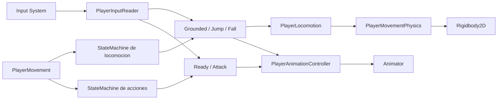
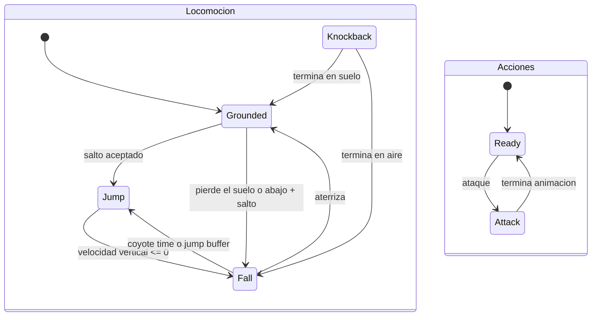

# Sistema del jugador

Esta carpeta contiene el movimiento, input, animacion, audio y estados de gameplay
del jugador. El objetivo de la arquitectura es mantener separadas las decisiones de
gameplay de la implementacion de fisica y de la presentacion visual.

## Flujo general



`PlayerMovement` es el punto de entrada utilizado por Unity. Durante `Awake()` crea
los servicios y estados, conecta sus dependencias y construye dos maquinas de estados.
La locomocion y las acciones avanzan en paralelo sin competir por un unico estado.

## Responsabilidades

| Script | Responsabilidad |
| --- | --- |
| `PlayerMovement` | Coordina los componentes de Unity, crea las dependencias y solicita cambios de estado. |
| `PlayerInputReader` | Traduce Input System a intenciones como mover, bajar, saltar y atacar. |
| `PlayerLocomotion` | Contiene las reglas compartidas de movimiento y salto. |
| `PlayerMovementPhysics` | Modifica el `Rigidbody2D`, gravedad, velocidad y deteccion de suelo. |
| `PlayerAnimationController` | Encapsula parametros y estados del Animator. |
| `PlayerDamageReaction` | Ejecuta feedback, knockback y muerte. |
| `PlayerSpeedModifier` | Mantiene la velocidad base y modificadores temporales. |
| `PlayerAudio` | Reproduce los sonidos locales del jugador. |
| `OneWayPlatform` | Marca y configura una plataforma que se atraviesa desde abajo o con abajo + salto. |
| `StateMachine` | Mantiene un estado activo por instancia y ejecuta su ciclo de vida. |

## Ejecucion por frame

`PlayerMovement.Update()` realiza este orden:

1. Actualiza la duracion de los modificadores de velocidad.
2. Comprueba el suelo mediante `PlayerLocomotion.UpdateGroundState()`.
3. Ejecuta la maquina de locomocion.
4. Si no existe knockback, ejecuta la maquina de acciones.
5. Cada estado activo decide su comportamiento y sus transiciones.
6. Actualiza el parametro de suelo del Animator.

Cada maquina posee un solo estado activo. Locomocion y accion si se ejecutan en el
mismo frame: por ejemplo, `Jump` puede convivir con `Attack`.

## Ciclo de un estado

Todos los estados implementan `IState`:

```csharp
internal interface IState
{
    void Enter();
    void Tick();
    void Exit();
}
```

Al cambiar de estado, `StateMachine` ejecuta:

```text
estado actual.Exit()
estado actual = estado nuevo
estado nuevo.Enter()
```

Los estados no conocen directamente a la maquina. Reciben callbacks `Action`, como
`requestJump` o `requestFall`, que apuntan a metodos privados de `PlayerMovement`.
Esto reduce el acoplamiento entre cada estado y el coordinador.

## Estados actuales

### Grounded

- Restaura la gravedad normal al entrar.
- Ejecuta movimiento horizontal terrestre.
- Actualiza el jump buffer.
- Cambia a `Jump` cuando la fisica acepta el salto.
- Cambia a `Fall` cuando pierde el suelo o atraviesa una plataforma hacia abajo.

### Jump

- Reproduce la animacion `jump` al entrar.
- Mantiene control horizontal aereo.
- Aplica salto variable segun si el boton sigue presionado.
- Cambia a `Fall` cuando la velocidad vertical llega a cero o se vuelve negativa.

### Fall

- Reproduce la animacion `fall` al entrar.
- Aplica gravedad de caida y limita la velocidad maxima.
- Mantiene control horizontal aereo.
- Permite saltar mediante coyote time o jump buffer.
- Cambia a `Grounded` al detectar el suelo.

### Attack

- Activa el parametro de ataque y reproduce el sonido de espada.
- Termina mediante un Animation Event.
- No modifica velocidad, gravedad, salto ni orientacion.
- Puede convivir con `Grounded`, `Jump` o `Fall`.
- Al terminar vuelve a `Ready` y restaura la animacion aerea si corresponde.

### Ready

- Espera la entrada de ataque sin modificar locomocion ni presentacion.
- Cambia a `Attack` al presionar el boton de espada.
- Es el punto de extension para el futuro ataque de shuriken.

### Knockback

- Detiene el movimiento anterior y aplica un impulso.
- Espera la duracion configurada.
- Al terminar vuelve a `Grounded` o `Fall`.

### Dead

- Activa la animacion y el sonido de muerte.
- Restaura la gravedad y detiene el movimiento.
- No ejecuta comportamiento durante `Tick()`.

## Transiciones principales



`Jump` y `Fall` reproducen directamente sus estados del Animator mediante
`Animator.Play()`. Mientras `Attack` esta activo, esos cambios visuales se posponen
para no interrumpir el golpe; la fisica aerea continua ejecutandose normalmente.

## Salto asistido

`PlayerMovementPhysics` mantiene dos contadores:

- `coyoteCounter`: permite saltar durante un instante despues de abandonar el suelo.
- `jumpBufferCounter`: recuerda una pulsacion realizada poco antes de aterrizar.

`TryJump()` solo aplica el impulso cuando ambos contadores permiten el salto. Al
saltar, consume los contadores para evitar saltos duplicados.

El salto variable utiliza dos ajustes:

- `jumpCutMultiplier`: reduce la velocidad vertical cuando se suelta el boton.
- `lowJumpGravityMultiplier`: aumenta la gravedad si no se mantiene el salto.

La caida utiliza `fallGravityMultiplier` y limita la velocidad mediante
`maxFallSpeed`.

## Descenso por plataformas

Al mantener abajo y presionar salto sobre un objeto con `OneWayPlatform`, el flujo es:

1. `PlayerInputReader` detecta `Down` y la pulsacion de `Jump`.
2. `PlayerLocomotion` valida que el suelo actual sea una plataforma atravesable.
3. `PlayerMovementPhysics` ignora temporalmente solo la colision entre ambos colliders.
4. `Grounded` solicita la transicion a `Fall`, que reutiliza el control aereo y la gravedad existentes.
5. La colision se restaura cuando el jugador queda debajo de la plataforma o vence el tiempo de seguridad.

No existe un estado `Drop` separado porque el comportamiento sostenido ya corresponde a
`Fall`; el descenso es una accion de transicion, no un estado con reglas propias por frame.

Bindings actuales:

- Teclado: `S` o flecha abajo + `Espacio`.
- Gamepad: stick izquierdo o D-pad hacia abajo + boton sur.
- Joystick generico: stick hacia abajo + trigger.

Para configurar una plataforma, su `Collider2D` y `OneWayPlatform` deben estar en el
mismo GameObject. El componente agrega y configura `PlatformEffector2D`. Si se usan
Tilemaps, las plataformas atravesables deben estar en un Tilemap separado: marcar el
Tilemap principal volveria atravesable todo su collider.

## Composicion

**Composicion** es el sustantivo y **compose** significa "componer" en ingles. No es
una clase ni un metodo especial de C#.

Este sistema usa composicion porque `PlayerMovement` construye objetos pequenos y
los conecta para formar el comportamiento completo del jugador. Por ejemplo:

```text
PlayerMovement
  contiene StateMachine de locomocion
  contiene StateMachine de acciones
  contiene PlayerLocomotion
  contiene PlayerAnimationController
  contiene PlayerDamageReaction
```

Ninguna de esas clases hereda de `PlayerMovement`. Cada una aporta una capacidad y
el resultado final se obtiene combinandolas.

`PlayerMovement.Awake()` tambien funciona como **Composition Root**: es el lugar
donde se crean los objetos y se conectan sus dependencias.

## Principios de mantenimiento

- Los estados deciden transiciones, pero no modifican directamente el Rigidbody.
- `PlayerMovementPhysics` no lee input ni decide estados.
- `PlayerInputReader` no contiene reglas de gameplay.
- `PlayerAnimationController` no decide fisica.
- La locomocion compartida no debe copiarse dentro de cada estado.
- Los valores ajustables deben permanecer serializados en `PlayerMovement` y pasar a `Settings`.
- Las clases auxiliares permanecen `internal` porque son detalles de implementacion del juego.
- `IState` y `StateMachine` viven en `Core/StateMachine` y se reutilizan por composicion.

## Agregar un estado

1. Crear una clase `internal sealed` que implemente `IState`.
2. Inyectar solamente las dependencias que necesita mediante el constructor.
3. Recibir callbacks `Action` para solicitar transiciones.
4. Crear el estado en `PlayerMovement.Awake()`.
5. Agregar metodos privados de cambio de estado en `PlayerMovement`.
6. Delegar fisica, animacion y audio a sus clases correspondientes.
7. Probar entrada, salida, interrupciones y convivencia con la otra maquina.

Un estado nuevo solo se justifica cuando agrega reglas de gameplay diferentes. Una
fase puramente visual puede resolverse dentro del Animator sin crear otro estado.
